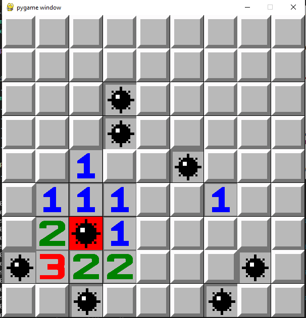

# Minesweeper with AI 


Minesweeper is a single-player puzzle video game. The objective of the game is to clear a rectangular board containing hidden "mines" or bombs without detonating any of them, with help from clues about the number of neighbouring mines in each field.

This repo contains two files:
- minesweeper.py: implementation of minesweeper
- minesweeperGUI.py: GUI version of the game with the help of  pygame code template for better gaming experience :)


### **Minesweeper with AI :** 
> Simple command-line implementation of minesweeper

This is a Python implementation of 2-D Minesweeper!
In order to "dig" at a certain location, you type in the index of the row, then the column, separated by a comma (whitespace optional). The game "digs" recursively around that location if there are no bombs nearby.

You can continue digging until either you hit a bomb (which is game over) or you've successfully dug up all n-b non-bomb locations (which is victory)!

playing Minesweeper with AI computer 
Results after matches!

```
   0  1  2  3  4  5  6  7  8  9  
----------------------------------
0 |  |  |  |  |  |  |  |  |  |  |
1 |  |  |  |  |  |  |  |  |  |  |
2 |  |  |  |  |  |  |  |  |  |  |
3 |  |  |  |  |  |  |  |  |  |  |
4 |  |  |  |  |  |  |  |  |  |  |
5 |  |  |  |  |  |  |  |  |  |  |
6 |  |  |  |  |  |  |  |  |  |  |
7 |  |  |  |  |  |  |  |  |  |  |
8 |  |  |  |  |  |  |  |  |  |  |
9 |  |  |  |  |  |  |  |  |  |  |
----------------------------------
Where would you like to dig? Input as Row , Coloum: 7,5
   0  1  2  3  4  5  6  7  8  9  
----------------------------------
0 |  |  |  |  |  |  |  |  |  |  |
1 |  |  |  |  |  |  |  |  |  |  |
2 |  |  |  |  |  |  |  |  |  |  |
3 |  |  |  |  |  |  |  |  |  |  |
4 |  |  |  |  |  |  |  |  |  |  |
5 |  |  |  |  |  |  |  |  |  |  |
6 |  |  |  |  |  |  |  |  |  |  |
7 |  |  |  |  |  |1 |  |  |  |  |
8 |  |  |  |  |  |  |  |  |  |  |
9 |  |  |  |  |  |  |  |  |  |  |
----------------------------------
Where would you like to dig? Input as Row , Coloum: 4,6
   0  1  2  3  4  5  6  7  8  9  
----------------------------------
0 |  |  |  |  |  |  |  |  |  |  |
1 |  |  |  |  |  |  |  |  |2 |1 |
2 |  |  |  |  |  |  |2 |1 |1 |0 |
3 |  |  |  |  |  |1 |1 |0 |0 |0 |
4 |  |  |  |  |  |1 |0 |0 |0 |0 |
5 |  |  |  |  |  |1 |0 |0 |0 |0 |
6 |  |  |  |  |  |2 |0 |0 |0 |0 |
7 |  |  |  |  |  |1 |0 |0 |0 |0 |
8 |  |  |  |  |  |2 |0 |0 |0 |0 |
9 |  |  |  |  |  |1 |0 |0 |0 |0 |
----------------------------------
Where would you like to dig? Input as Row , Coloum: 3,4
   0  1  2  3  4  5  6  7  8  9  
----------------------------------
0 |  |  |  |  |  |  |  |  |  |  |
1 |  |  |  |  |  |  |  |  |2 |1 |
2 |  |  |  |  |  |  |2 |1 |1 |0 |
3 |  |  |  |  |2 |1 |1 |0 |0 |0 |
4 |  |  |  |  |  |1 |0 |0 |0 |0 |
5 |  |  |  |  |  |1 |0 |0 |0 |0 |
6 |  |  |  |  |  |2 |0 |0 |0 |0 |
7 |  |  |  |  |  |1 |0 |0 |0 |0 |
8 |  |  |  |  |  |2 |0 |0 |0 |0 |
9 |  |  |  |  |  |1 |0 |0 |0 |0 |
----------------------------------
Where would you like to dig? Input as Row , Coloum: 2,5
You Loose!!
----------------------------------
0 |0 |0 |0 |0 |0 |0 |1 |1 |2 |* |
1 |0 |0 |0 |0 |1 |1 |2 |* |2 |1 |
2 |0 |0 |1 |1 |2 |* |2 |1 |1 |0 |
3 |0 |0 |1 |* |2 |1 |1 |0 |0 |0 |
4 |0 |0 |1 |2 |2 |1 |0 |0 |0 |0 |
5 |0 |0 |0 |1 |* |1 |0 |0 |0 |0 |
6 |0 |0 |0 |2 |2 |2 |0 |0 |0 |0 |
7 |1 |1 |1 |1 |* |1 |0 |0 |0 |0 |
8 |3 |* |2 |2 |2 |2 |0 |0 |0 |0 |
9 |* |* |2 |1 |* |1 |0 |0 |0 |0 |
----------------------------------
```

## **Minesweeper with GUI :**

This is a Python implementation of 3-D Minesweeper!

The game is played by revealing squares of the grid by clicking or otherwise indicating each square. If a square containing a mine is revealed, the player loses the game. If no mine is revealed, a digit is instead displayed in the square, indicating how many adjacent squares contain mines; if no mines are adjacent, the square becomes blank, and all adjacent squares will be recursively revealed. The player uses this information to deduce the contents of other squares and may either safely reveal each square or mark the square as containing a mine

 


### Module used


## PRE-REQUISITES
Your laptop with 3.7.x (onwards) installed.

**NOTE:** Those with Linux and MacOSX would have Python installed by default, no action required.

Windows: Download the version for your laptop via https://www.python.org/downloads/

**NOTES**
In your preferred editor, make sure indentation is set to "4 spaces".

---

Do not Delete any images Files or IT MAY CRASH THE GAME!

## Run using Python3.8+
1. Clone or download repositiory: https://github.com/arevish/minesweeperGUI.git
2. In source folder, run `python3 'tr.py'` to start program, optionally, run with `--help` argument to see other runtime options.

 
 
### ThankYou!
